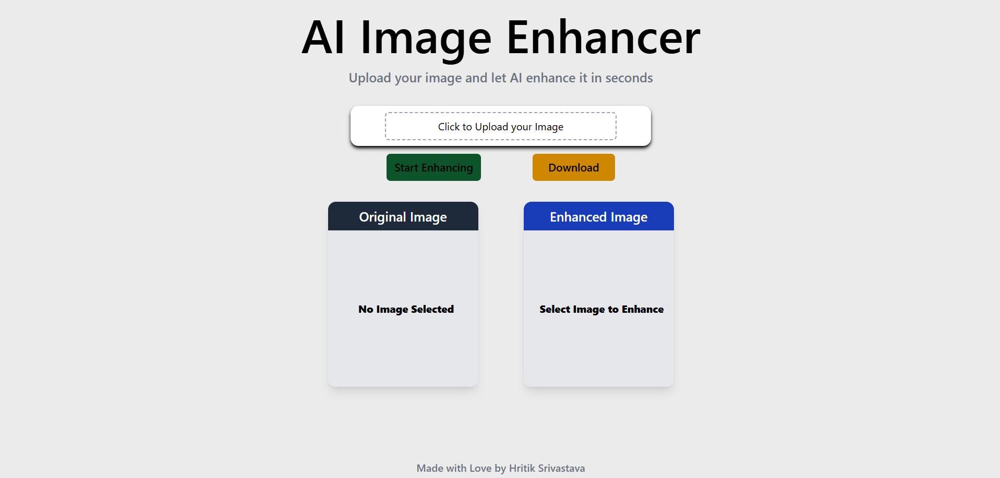
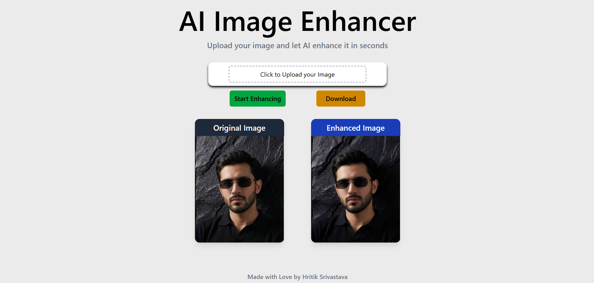

# 🚀 AI Image Enhancer

A modern AI-powered image enhancement web application built with **React**, **Vite**, **Context API**, **Axios**, and **Tailwind CSS**. The application allows users to upload an image, process it using an external AI enhancement service, preview the enhanced result, and download the processed image directly from the browser.

Unlike traditional image editing applications that perform processing locally, this project integrates with an asynchronous AI image enhancement API and implements a polling mechanism to continuously monitor task progress until the enhanced image becomes available.

The primary goal of this project was to strengthen my understanding of asynchronous workflows, React state management, API communication, file handling, and frontend application architecture while building a production-like user experience.

---

## 🌐 Live Demo

> **Live Application:** *(Add Vercel URL here after deployment)*

---

## 📷 Preview

### Desktop

<p align="center">

</p>

### Image Enhancement

<p align="center">

</p>


---

# ✨ Features

- Upload local images directly from the device
- Client-side image preview before processing
- AI-powered image enhancement through an external REST API
- Asynchronous task processing with automatic polling
- Real-time loading state during enhancement
- Side-by-side comparison of original and enhanced images
- Download enhanced image with original filename preserved
- Automatic button state management based on application state
- Responsive interface for desktop and mobile devices
- Modular React component architecture
- Context API powered global state management
- Environment variable support for API credentials

---

# 🛠 Tech Stack

| Technology | Purpose |
|------------|---------|
| React | Component-based UI development |
| Vite | Development server and production bundler |
| Tailwind CSS | Utility-first styling |
| Context API | Global state management |
| Axios | HTTP client for API communication |
| JavaScript (ES6+) | Application logic |
| HTML5 | Application structure |
| CSS3 | Additional styling support |

---

# 📌 Project Overview

The application follows a complete asynchronous processing workflow.

Instead of directly returning an enhanced image after upload, the external AI service creates an enhancement task and immediately returns a **Task ID**.

The frontend then continuously checks the task status by sending periodic requests until processing is completed. Once the task reaches completion, the enhanced image URL is received, stored in the global application state, rendered inside the UI, and made available for download.

This architecture closely resembles many real-world frontend applications that communicate with long-running backend services instead of receiving immediate responses.

---

# 🎯 Objectives

This project was built to gain practical experience with:

- React component architecture
- Context API state management
- File uploads using FormData
- REST API integration
- Axios request handling
- Async/Await programming
- Polling asynchronous APIs
- Loading state management
- Conditional rendering
- Environment variable management
- Browser-based file downloads
- Production-oriented frontend development

---

# ⚙️ Core Workflow

```

User Selects Image
│
▼
Generate Local Preview
│
▼
Store File & Preview in Context API
│
▼
Click "Start Enhancing"
│
▼
Upload Image to AI API
│
▼
Receive Task ID
│
▼
Poll Task Status
│
▼
Processing Complete
│
▼
Receive Enhanced Image URL
│
▼
Update Global State
│
▼
Render Enhanced Image
│
▼
Download Enhanced Image

```

---

# 📂 Project Structure

```

src/
│
├── components/
│ ├── Context/
│ ├── Header.jsx
│ ├── Footer.jsx
│ ├── ActionBtn.jsx
│ ├── Enhanced.jsx
│ ├── FunctionBtns.jsx
│ ├── StartBtn.jsx
│ ├── ExportBtn.jsx
│ ├── ImageCard.jsx
│ ├── ImageContainer.jsx
│ └── enhanceImageApi.js
│
├── App.jsx
└── main.jsx

```

The project follows a modular component-based architecture where each UI responsibility is isolated into reusable React components, while shared application state is managed centrally using the Context API.

---

# 🏗️ Application Architecture

The application follows a modular component-based architecture where each component is responsible for a single concern. Shared application state is managed centrally using the React Context API, allowing components to communicate without excessive prop drilling.

```
                           App
                            │
          ┌─────────────────┼─────────────────┬───────────────────────┐
          │                 │                 │                       │
       Header          ActionBtn       ImageContainer                Footer
                            │                 │
                     ┌──────┴──────┐    ┌─────┴─────┐
                     │             │    │           │
                FunctionBtns   Upload     Original Card
                     │                      Enhanced Card
          ┌──────────┴──────────┐
          │                     │
      StartBtn             ExportBtn
```

Business logic responsible for communicating with the AI enhancement service is isolated inside a dedicated API utility module (`enhanceImageApi.js`), keeping UI components focused solely on presentation and user interactions.

---

# ⚛️ State Management

Global application state is managed using the **React Context API**.

Instead of passing state across multiple component levels, shared data is stored within a central provider, making it accessible throughout the application.

The global state consists of:

| State | Purpose |
|--------|---------|
| `file` | Stores the uploaded image file |
| `Previewimg` | Stores the browser preview URL generated using `URL.createObjectURL()` |
| `Enhancedimg` | Stores the final enhanced image URL returned by the API |
| `loader` | Indicates whether an enhancement request is currently in progress |

This approach simplifies component communication while keeping the application scalable and maintainable.

---

# 🔄 Image Enhancement Workflow

The enhancement process follows a multi-step asynchronous workflow.

```
User Uploads Image
        │
        ▼
Image Stored in Context
        │
        ▼
Generate Local Preview
        │
        ▼
Click "Start Enhancing"
        │
        ▼
Create FormData
        │
        ▼
POST Request
/api/tasks/visual/scale
        │
        ▼
Receive Task ID
        │
        ▼
Start Polling
        │
        ▼
GET Request
/api/tasks/visual/scale/{task_id}
        │
        ▼
Task Completed
        │
        ▼
Receive Enhanced Image URL
        │
        ▼
Update Context API
        │
        ▼
React Re-render
        │
        ▼
Enhanced Image Displayed
```

Instead of waiting for a single API response, the application continuously monitors task progress until image processing has been completed.

---

# 🌐 API Communication

The application communicates with an external AI image enhancement service using Axios.

The enhancement process consists of two separate API interactions.

### 1. Upload Request

The selected image is uploaded as `multipart/form-data`.

Additional request parameters specify:

- asynchronous processing
- response format

The API responds with a unique **Task ID** rather than the processed image.

---

### 2. Polling Request

After receiving the Task ID, the application periodically checks the task status by sending GET requests.

The polling loop continues until processing reaches completion.

Once completed, the API returns the URL of the enhanced image, which is stored inside the global application state.

This architecture closely resembles real-world applications where computationally expensive operations are performed asynchronously.

---

# 🔁 Polling Strategy

Unlike synchronous APIs, image enhancement requires server-side processing time.

To accommodate this, the application implements a polling mechanism.

```
Upload Image
      │
      ▼
Receive Task ID
      │
      ▼
Request Status
      │
      ▼
progress = 0
      │
      ▼
Wait 1 Second
      │
      ▼
Request Again
      │
      ▼
progress = 35
      │
      ▼
Wait 1 Second
      │
      ▼
Request Again
      │
      ▼
progress = 100
      │
      ▼
Return Enhanced Image
```

Polling is implemented using asynchronous loops with `async/await`, ensuring the UI remains responsive while the enhancement process executes in the background.

---

# 📁 File Upload Handling

The application accepts local image uploads using the native file input element.

Upon selection:

1. The uploaded file is stored for API submission.
2. A temporary browser object URL is generated using `URL.createObjectURL()`.
3. The preview URL is rendered immediately inside the Original Image card.

This provides instant visual feedback without requiring the image to be uploaded first.

Additionally, defensive validation ensures that users closing the file picker without selecting a file does not trigger runtime errors.

---

# 🎨 Rendering Strategy

The interface relies on conditional rendering to display the appropriate UI state.

Depending on the application's current state, each image card dynamically renders one of the following:

- Placeholder
- Loading indicator
- Original image preview
- Enhanced image

This approach avoids unnecessary DOM updates while providing clear visual feedback throughout the enhancement process.

---

# 🔐 Environment Variables

Sensitive configuration values such as API credentials are not hardcoded into the application.

Instead, they are accessed through Vite environment variables.

```
.env

VITE_API_KEY=Api_key
```

This improves security, prevents accidental exposure of credentials, and simplifies deployment across different environments.

---

# 🧩 Component Responsibilities

| Component | Responsibility |
|-----------|----------------|
| `Header` | Displays application title and description |
| `ActionBtn` | Handles image upload functionality |
| `StartBtn` | Initiates AI enhancement process |
| `ExportBtn` | Downloads enhanced image |
| `ImageContainer` | Organizes preview cards |
| `ImageCard` | Reusable card component for displaying images |
| `Context/Image.jsx` | Global state management |
| `enhanceImageApi.js` | Handles API communication and polling |

Each component follows the principle of single responsibility, improving maintainability and enabling easier future expansion.

---

# 🚀 Getting Started

Follow the steps below to run the project locally.

## Prerequisites

Ensure the following software is installed on your machine:

- Node.js (v18 or later recommended)
- npm
- Git

---

## Installation

Clone the repository:

```bash
git clone https://github.com/your-username/AI-Image-Enhancer.git
```

Navigate to the project directory:

```bash
cd AI-Image-Enhancer
```

Install dependencies:

```bash
npm install
```

---

## Environment Variables

Create a `.env` file in the project root.

```env
VITE_API_KEY=your_api_key
```

> **Note:** The API key is intentionally excluded from version control. Obtain your own key before running the application.

---

## Start Development Server

```bash
npm run dev
```

Open your browser and visit:

```
http://localhost:5173
```

---

## Production Build

Generate an optimized production build:

```bash
npm run build
```

Preview the production build locally:

```bash
npm run preview
```

---

# ⚙️ Engineering Decisions

## Context API over Prop Drilling

Since multiple components require access to the uploaded image, enhanced image, and loading state, the React Context API was chosen to centralize shared state.

This avoids deeply nested prop passing while keeping the application architecture clean and scalable.

---

## Separation of UI and Business Logic

Rather than embedding API calls directly inside UI components, all network communication is isolated within `enhanceImageApi.js`.

This separation improves:

- Readability
- Maintainability
- Reusability
- Testing potential

UI components remain responsible only for rendering and user interactions.

---

## Async/Await over Promise Chaining

The application uses `async/await` throughout the API workflow.

This results in code that is easier to follow, particularly when implementing sequential operations such as:

1. Upload image
2. Receive task ID
3. Poll task status
4. Receive enhanced image

Compared to chained promises, async/await provides a cleaner and more maintainable control flow.

---

## Polling instead of Blocking Requests

The external enhancement service processes images asynchronously.

Instead of waiting indefinitely for a response, the application repeatedly checks task progress at fixed intervals.

Advantages include:

- Non-blocking UI
- Better user experience
- Lower risk of request timeout
- Easier progress monitoring

---

## Component Reusability

The application uses a single reusable `ImageCard` component to display both the original and enhanced images.

Rather than creating separate components with duplicated logic, rendering behavior is controlled using component props.

This keeps the codebase smaller and easier to maintain.

---

# ⚡ Performance Considerations

Several implementation choices were made to improve responsiveness and reduce unnecessary operations.

### Immediate Local Preview

The uploaded image is displayed immediately using `URL.createObjectURL()`.

This removes the need to wait for network requests before rendering the preview.

---

### Conditional Rendering

Components render only the content required for the current application state.

Depending on state, the interface displays:

- Placeholder
- Loading state
- Original image
- Enhanced image

This avoids unnecessary rendering logic.

---

### Disabled Actions

Interactive controls are enabled or disabled according to application state.

Examples include:

- Enhancement cannot begin before selecting an image.
- Multiple enhancement requests are prevented while processing.
- Download remains unavailable until enhancement completes.

These safeguards improve both user experience and application reliability.

---

### Centralized State Updates

Keeping shared state inside the Context API minimizes inconsistent UI behavior across components and ensures all dependent components re-render with the latest data.

---

# 🛡️ Error Handling

The application includes defensive programming practices to prevent common runtime issues.

Implemented safeguards include:

- Validation when no file is selected.
- Prevention of duplicate enhancement requests.
- Graceful handling of failed API requests.
- Automatic loader cleanup using `finally`.
- Download protection until an enhanced image is available.
- Validation of API responses before accessing returned data.

These checks improve application stability and reduce unexpected failures during user interaction.

---

# 📱 Responsive Design

The interface has been designed with responsiveness in mind.

Layout adjustments are handled using Tailwind CSS responsive utilities, ensuring the application remains usable across desktop and smaller screen sizes.

The design emphasizes simplicity, accessibility, and consistent spacing without sacrificing functionality.

---

# 🔒 Security Considerations

API credentials are stored using Vite environment variables instead of being hardcoded into the source code.

This prevents accidental exposure of sensitive information within the project's Git history and simplifies deployment across different environments.

Although the application communicates directly with a third-party API from the client side, environment variables help maintain cleaner project configuration and improve development practices.

---

# 🚧 Future Enhancements

The current implementation focuses on delivering a clean and reliable image enhancement workflow. Several improvements are planned to further expand the application's functionality and user experience.

### Planned Features

- Image enhancement quality selection
- Drag-and-drop image upload
- Image cropping before enhancement
- Side-by-side comparison slider
- Enhancement history
- Download progress indicator
- Multiple output formats (PNG, JPG, WebP)
- Batch image enhancement
- Progress bar based on API status
- Dark mode support
- Toast notifications for user feedback
- Keyboard accessibility improvements
- Image compression before upload
- Retry mechanism for failed API requests

These enhancements would improve usability while providing opportunities to explore more advanced frontend engineering concepts.

---

# 📚 Key Learning Outcomes

Developing this project provided practical experience with several important frontend engineering concepts beyond simply building user interfaces.

### React Concepts

- Component-based architecture
- Context API for global state management
- State-driven rendering
- Component communication
- Reusable UI components

### JavaScript Concepts

- Async/Await
- Promises
- FormData
- File handling
- Browser APIs
- Object URLs
- Dynamic DOM interactions

### API Integration

- REST API communication
- File uploads
- HTTP request handling with Axios
- Polling asynchronous services
- Parsing API responses
- Handling asynchronous workflows

### Software Engineering

- Separation of concerns
- Defensive programming
- State management
- Error handling
- Environment variable management
- Modular project organization
- Production-oriented application structure

---

# 💡 Challenges Faced

Several implementation challenges were encountered during development.

### Asynchronous Image Processing

Unlike traditional APIs that immediately return processed data, the AI enhancement service creates a background task and returns a unique Task ID.

Implementing a polling mechanism to monitor task completion required understanding asynchronous application flow and sequential request handling.

---

### State Synchronization

Multiple components depended on shared application state, including:

- Upload controls
- Loading indicators
- Image previews
- Download functionality

The React Context API was introduced to centralize state management and eliminate unnecessary prop drilling.

---

### User Experience

Ensuring a smooth user experience involved handling numerous UI states, including:

- No image selected
- Image preview
- Processing state
- Enhancement completed
- Download availability
- Invalid user actions

Each state required conditional rendering and proper synchronization with application data.

---

### Secure Configuration

API credentials were moved to environment variables to avoid exposing sensitive information within the source code and to simplify deployment across environments.

---

# 🤝 Acknowledgements

This project integrates an external AI image enhancement service to perform server-side image processing.

Image enhancement functionality is powered by the PicWish AI Image Enhancement API.

---

# 👨‍💻 Author

**Hritik Srivastava**

Frontend Developer passionate about building responsive, interactive, and performance-focused web applications while continuously improving software engineering skills through hands-on projects.

### Connect with me

- GitHub: **https://github.com/Arpit9320**
- LinkedIn: **https://www.linkedin.com/in/hritiksrivastava11/**
- Portfolio: *(Coming Soon)*

---

# 📄 License

This project is licensed under the **MIT License**.

You are free to use, modify, and distribute this project in accordance with the terms of the license.

---

# ⭐ Support

If you found this project helpful or interesting:

- ⭐ Star the repository
- 🍴 Fork the project
- 🛠️ Share suggestions or improvements
- 💬 Connect with me to discuss frontend development

Feedback and contributions are always appreciated.

---

<div align="center">

**Built with React, Context API, Axios, Tailwind CSS & ❤️ by Hritik Srivastava**

</div>